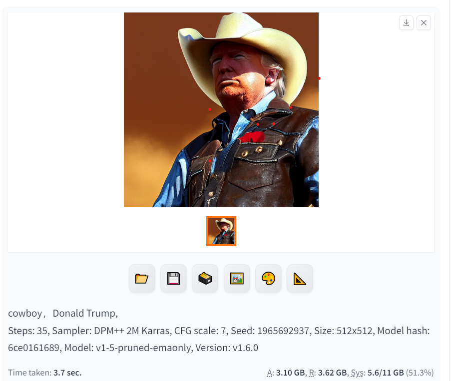
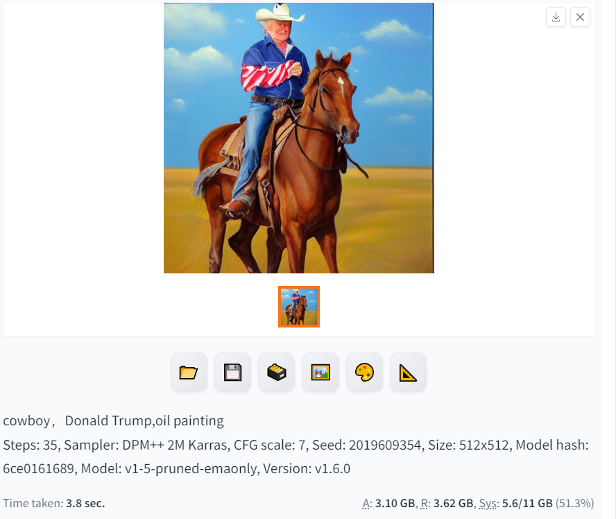

# 2-1 提示词

## 0 章节目标

- 了解提示词的基本类型
- 了解不同类型提示词使用方法
- 了解提示词的使用效果

## 1 提示词类型
一组好的提示词往往包含多个类型方面，每个不同的类型描述可以达到不同的效果，经过多个描述的综合作用就能够生成优质的AI艺术品。

以下内容以 v1-5-pruned-emaonly这个模型作为示例，内容主体我们选择Donald Trump（美国前总统）。采样器我们选择DPM++ 2M Karras，采样步数我们选择35，CFG Scale选择7，高度和宽度都是512。

### 1.1 类型概述
提示词的类型主要包含以下几类：
* 主题（subject）
* 材质（Medium）
* 风格（Style）
* 艺术家（Artist）
* 参考网站（Website）
* 分辨率（Resolution）
* 额外细节（Additional details）
* 颜色（Color）
* 光影（Lighting）

每次的提示词撰写都可以依据这个类型清单进行选取和构思。需要注意的是，提示词用英文撰写可以达到更好的效果，因此一些提示词会是一些简单的英文词汇。

### 1.2 主题（Subject）
主题就是我们需要生成的主要内容，比如一个人物，或者一个物品。由于Stable Difussion是需要理解自然语言再生成图像内容的，因此选取名人往往更能够达到一个好的效果，因此在这里我们选取特朗普作为我们今天的主角。此外我们为特朗普设定一个西部牛仔的风格，从而更好的展现Stable Difussion的强大能力。

我们很快得到了西部牛仔着装的特朗普，效果看起来还不错。同时我们可以根据后续类型提示词的添加一步步看到提示词的强大影响力。

### 1.2 材质（Medium）
材质指的是绘画的材料如油画，照相，3D等，材质同样对绘画结果有着非常巨大的影响。
让我加上关键词 oil painting（油画)

可以看到加上这个提示词之后生成的效果就明显有了油画的风格。